# Linux Recycle Bin System

## Author
Margarida Almeida Cardoso - 125799
Enrique Alejandro Iriza de Ornelas - 124762

## Description
This project consists of implementing a Recycle Bin system for Linux, inspired by the Windows Recycle Bin functionality. Developed in Bash Shell Script, the system allows users to safely delete files with the possibility of restoring them before permanent removal. It includes features such as metadata logging, file listing and search capabilities, and automatic cleanup.

## Installation
Instruction to make the script executable:
- Command: "chmod u+x recycle_bin.sh"

## Usage
To use the recycle bin system, run the script followed by one of the supported commands. Below are examples of each feature:

##### - Delete files or directories
eg. ./recycle_bin.sh delete myfile.txt
    ./recycle_bin.sh delete file1.txt folder1/

---

##### - List contents of the recycle bin
eg. ./recycle_bin.sh list #compact table view
    ./recycle_bin.sh list --detailed #detailed view

You can sort the output by setting an environment variable:
eg. export RECYCLE_BIN_SORT_BY=name   # Sort by name
    export RECYCLE_BIN_SORT_BY=size   # Sort by size
    export RECYCLE_BIN_SORT_BY=date   # Sort by deletion date (default)

---

##### - Restore a file
eg. ./recycle_bin.sh restore ID
    ./recycle_bin.sh restore "report.docx"

---

##### - Search for files
eg. ./recycle_bin.sh search "report"
    ./recycle_bin.sh search "*.pdf"

---

##### - Empty the recycle bin
eg. ./recycle_bin.sh empty                # Interactive full deletion
    ./recycle_bin.sh empty "myfile.txt"  # Delete specific item by name or ID
    ./recycle_bin.sh empty --force       # Force delete all without confirmation

---

##### - Auto-cleanup
eg. ./recycle_bin.sh auto

---

##### - Show statistics
eg. ./recycle_bin.sh stats

---

##### - Help
eg. ./recycle_bin.sh help

---

## Features
### Core Features
-Feature 1: Initialize Recycle Bin

-Feature 2: Delete Files/Directories

-Feature 3: List Recycle Bin Contents

-Feature 4: Restore Files

-Feature 5: Search Files

-Feature 6: Empty Recycle Bin

-Feature 7: Help System
### Extra Features
-Feature 8: Statistics Dashboard

-Feature 9: Auto-Cleanup

## Configuration
The recycle bin system uses a configuration file located at ~/.recycle_bin/config. This file defines key operational settings that control how the system behaves.

Available Settings:
- AUTO_CLEANUP_DAYS=30 Number of days a file remains in the recycle bin before being eligible for automatic deletion.
- MAX_SIZE_MB=1024 Maximum total size (in megabytes) allowed for the recycle bin. If exceeded, the system will warn the user and prevent further deletions.

How to Edit these settings?
Run any of the recycle_bin features:
eg: 
```bash
./recycle_bin.sh help
```

Open the configuration file with a text editor:
eg: 
```bash
nano ~/.recycle_bin/config
```
And edit it!


## Examples
This section demonstrates how to use each feature of the recycle bin system (the ones I refered in the usage topic). Screenshots should be placed in the "screenshots/" folder using the filenames listed below.

##### - Delete files or directories
###### eg1. ./recycle_bin.sh delete myfile.txt

First you must make the file you will then delete: 

```bash
echo "Whateverrrr" > myfile.txt
```

After that, you must be able to delete it: 

```bash
./recycle_bin.sh delete myfile.txt
```
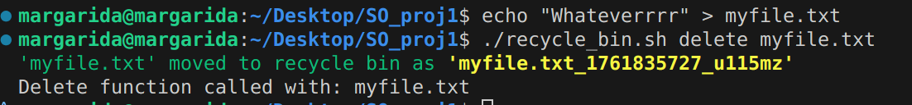


###### eg2.  ./recycle_bin.sh delete file1.txt folder1/

First you must make the file, the folder and insert the file into the folder:

```bash
echo "This is a test file." > myfile.txt
echo "Another file." > file1.txt
mkdir folder1
echo "Inside folder" > folder1/note.txt
```

Then you must be able to delete:

```bash
./recycle_bin.sh delete file1.txt folder1/
```

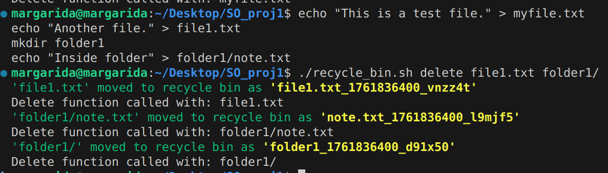

##### - List contents of the recycle bin
###### eg1. ./recycle_bin.sh list #compact table view

Just do it! If it's empty it will let you know.
```bash
./recycle_bin.sh list
```

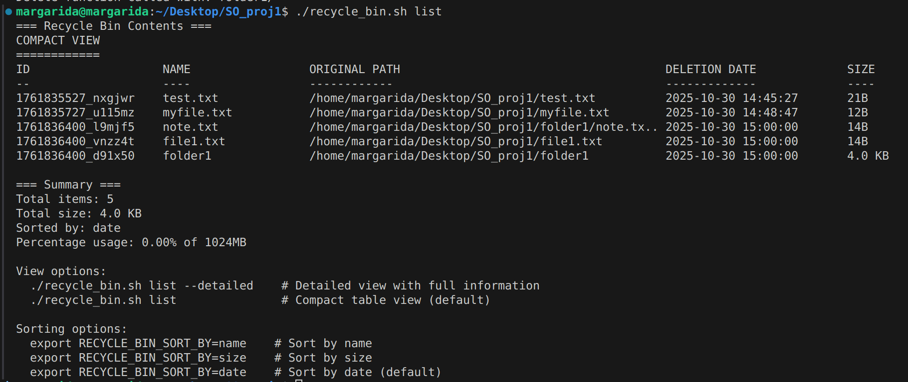

###### eg2. ./recycle_bin.sh list --detailed #detailed view

Just do it! If it's empty it will let you know.
```bash
./recycle_bin.sh list --detailed
```

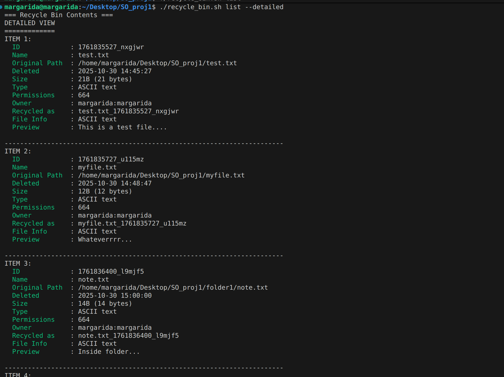
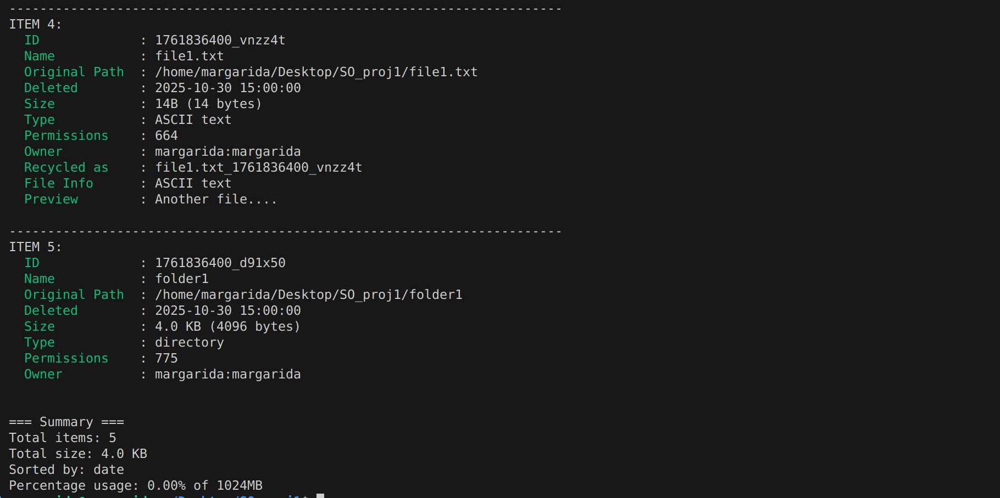

You can sort the output by setting an environment variable:
eg. export RECYCLE_BIN_SORT_BY=name   # Sort by name
    export RECYCLE_BIN_SORT_BY=size   # Sort by size
    export RECYCLE_BIN_SORT_BY=date   # Sort by deletion date (default)

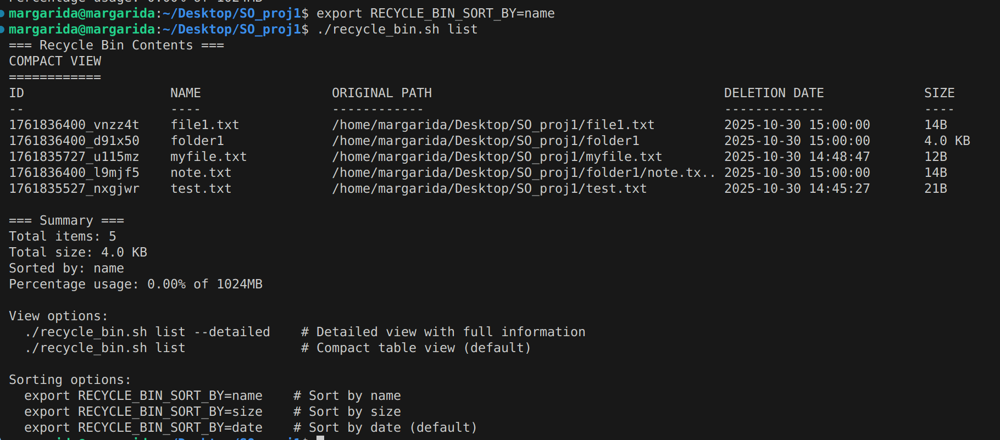


##### - Restore a file
###### eg1. ./recycle_bin.sh restore ID
In this example you are restoring by ID.

Before restoring it, you have to make it, delete it and list it, just so you know its ID:
```bash
echo "Conteúdo de teste" > exemplo.txt
./recycle_bin.sh delete exemplo.txt
./recycle_bin.sh list --detailed
```
When you list it make sure to check the ID.
In this next step you need to replace the ID for its actual ID.

Then you must be able to restore it by its ID:
```bash
./recycle_bin.sh restore ID
```

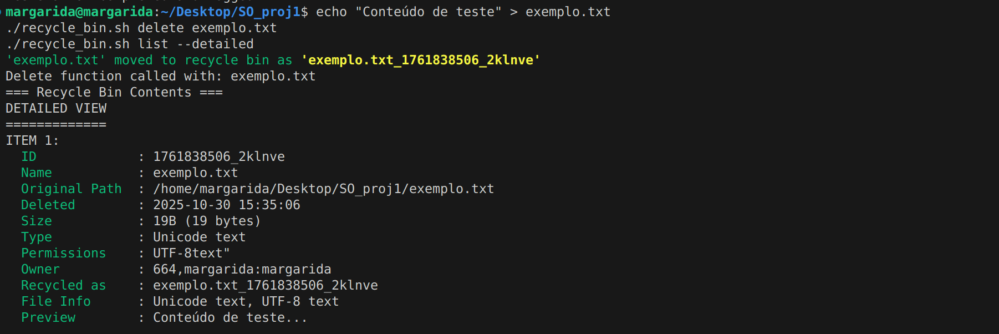

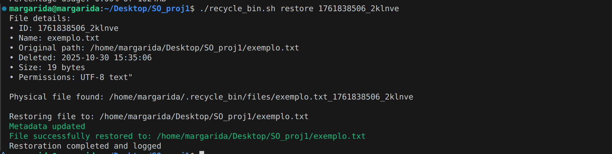


###### eg2. ./recycle_bin.sh restore "report.docx"
In this example you are restoring by name
Before restoring it, you need to make it and delete it:
```bash
echo "This is a sample report." > report.docx
./recycle_bin.sh delete report.docx
```

Then you must be able to restore:
```bash
./recycle_bin.sh restore "report.docx"
```

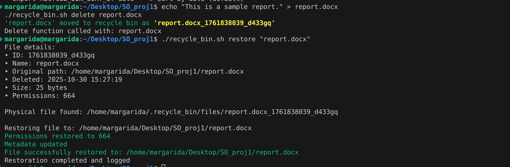

##### - Search for files
###### eg1. ./recycle_bin.sh search "report"
First you need to make the something with report on its name and delete it. Otherwise, there will be no matches found.

```bash
echo "This is a sample report." > report.docx
./recycle_bin.sh delete report.docx
```
Then you must be able to get at least one match.
```bash
./recycle_bin.sh search "report"
```
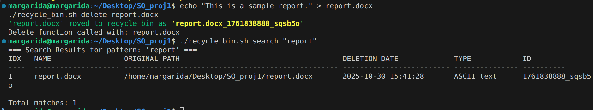


###### eg2. ./recycle_bin.sh search "*.pdf"

First you need to make the some pdf files and delete it. Otherwise, there will be no matches found.
```bash
echo "PDF 1" > report1.pdf
echo "PDF 2" > notes.pdf
./recycle_bin.sh delete report1.pdf
./recycle_bin.sh delete notes.pdf
```

Then you must be able to get at least two matches.
```bash
./recycle_bin.sh search "*.pdf"
```
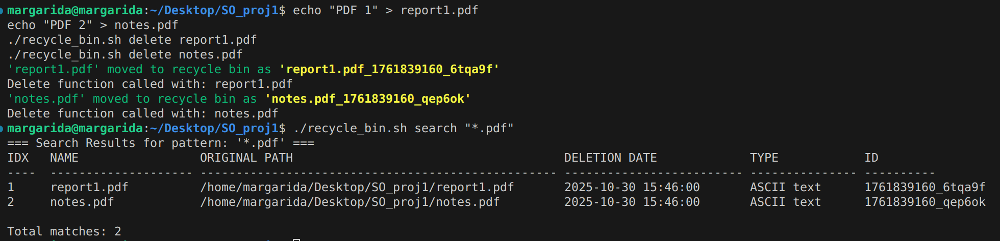

##### - Empty the recycle bin
###### eg1. ./recycle_bin.sh empty                # Interactive full deletion

If you did the previous steps you will have something to delete in your recycle bin.
If you don't have anything it will let you know.
```bash
./recycle_bin.sh empty
```
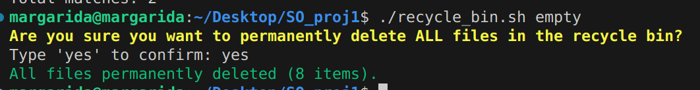
###### eg2. ./recycle_bin.sh empty "myfile.txt"  # Delete specific item by name or ID

Create the myfile.txt and delete it:
```bash
echo "Conteúdo de teste" > myfile.txt
./recycle_bin.sh delete myfile.txt
```
Empty it from the recycle bin:
```bash
./recycle_bin.sh empty "myfile.txt"
```
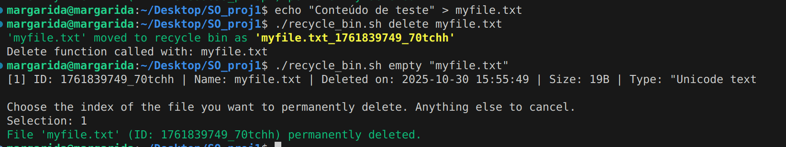


###### eg3. ./recycle_bin.sh empty --force       # Force delete all without confirmation
This command does the exact same as the eg1, it just doesn't ask for permission.

Just do it! If you recycle bin is empty it will let you know.
```bash
./recycle_bin.sh empty --force 
```
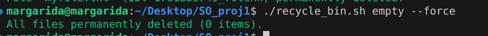

##### - Auto-cleanup
###### eg. ./recycle_bin.sh auto

This command automatically checks all files in the recycle bin and deletes those that have been there longer than the configured retention period. The time limit is defined in the script’s configuration. Any file that exceeds this threshold is permanently removed.

```bash
./recycle_bin.sh auto
```


##### - Show statistics
###### eg. ./recycle_bin.sh stats
In case you don't have anything in the recycle bin:
```bash
echo "Report" > report.docx
echo "Notes" > notes.txt
echo "Data" > data.csv
./recycle_bin.sh delete report.docx
./recycle_bin.sh delete notes.txt
./recycle_bin.sh delete data.csv
```

Then you should be able to see its stats:
```bash
./recycle_bin.sh stats
```

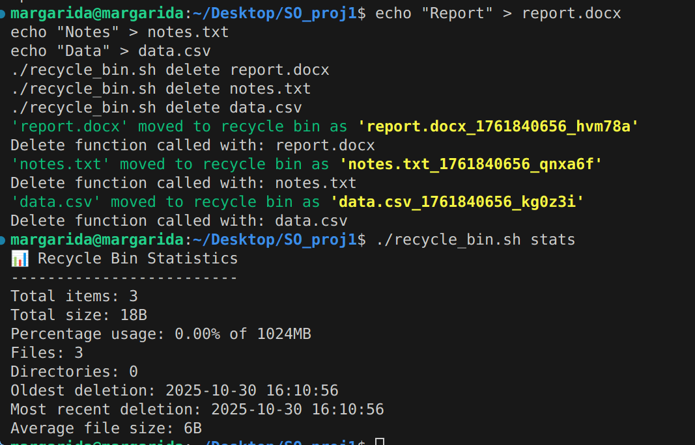

##### - Help
###### eg. ./recycle_bin.sh help

This command will give a usage guide for your project.

```bash
./recycle_bin.sh help
```
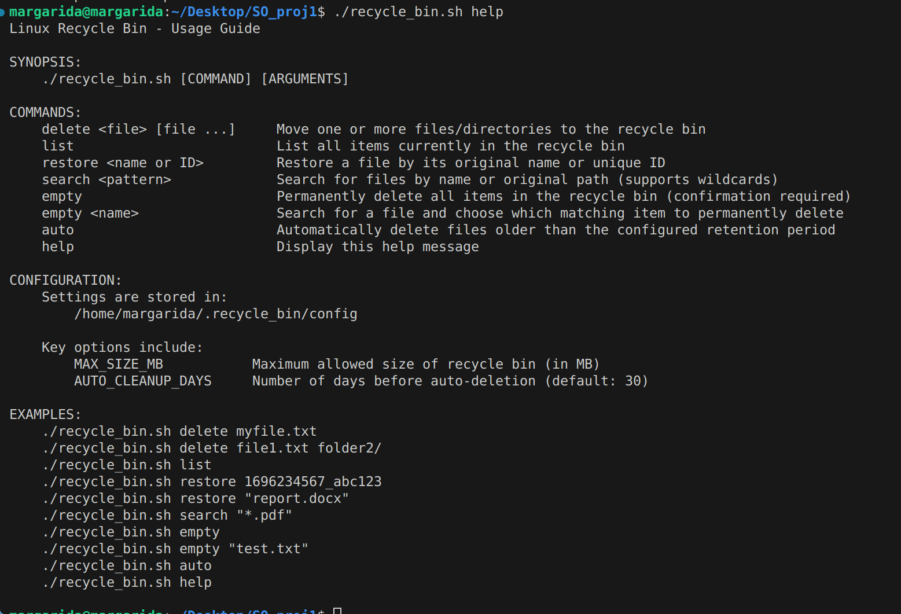
## Known Issues
### Issue 1: Symbolic Link Handling
- **Description:** Symbolic links are handled with the name of the target file.
- **Impact:** Medium
- **Workaround:** Restore the file with a different new name.
- **Plan:** Will implement in future version

### Issue 2: Very Long Filenames
- **Description:** Filenames over 255 characters cause truncation in dis-
play
- **Impact:** Low (display only, functionality works)
- **Workaround:** Use ID for operations
- **Plan:** Implement better truncation algorithm

### Issue 3: Restoration of original permissions of a read-only directory 
- **Description:** When we restore a file to a read only directory we change it's permissions to read and write, but don't restore the permissions to read-only.
- **Impact:** Medium
- **Workaround:** None currently
- **Plan:** Implement a better restoration method.

### Issue 4: Handling Commas
- **Description:** Due to the CSV base of metadata we ended up removing the commas when they are in a filename. The file doesn't lose any information, just changes the filename.
- **Impact:** Low
- **Workaround:** None currently
- **Plan:** Implement a better regex.

## References
### AI assistance
We used AI assistance for error handling optimization, command explanation generation, and debugging complex shell scripting scenarios. 
### Online resources
The primary online resource consulted throughout development was Stack Overflow (stackoverflow.com).
Command usage and syntax were verified using the Linux manual pages system via the man command.
